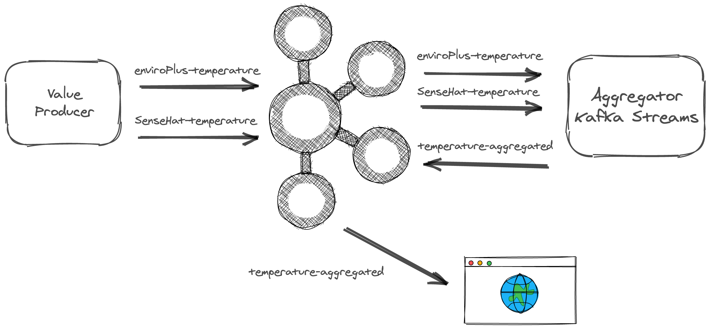

## Kafka-weather-station

This is a base use case that I can explore in future blogs. The weather stations are a simple idea where I can use a different source of data to get temperature, pressure, or humidity, send this to a Kafka topic, add an aggregator to do some Kafka Streams, like calculate average per hour and on the end, I can create several topics to play around the idea. I can add some kind of visualization and so on. It is a simple idea, but it is an idea that I can explore a lot of scenarios and I can easily expand and add more things.

- [Blog](http://www.igfasouza.com/blog/kafka-weather-station/)
